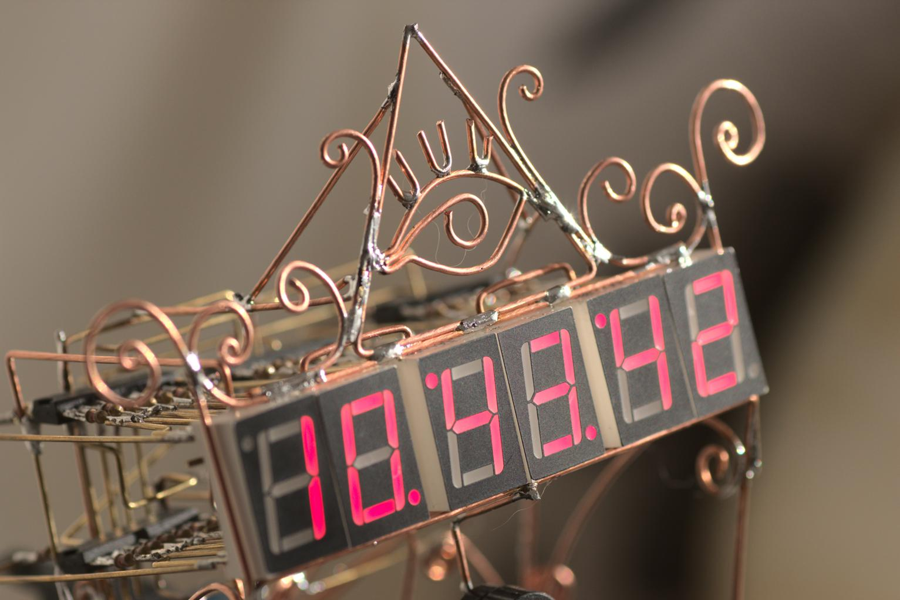

# Lavva kellä
Circuit Sculpture "Lavva kellä".

It is a small desk clock. Once a day it synchronizes a clock with NTP time server.

More images at [taunoerik.art](https://taunoerik.art/portfolio/lavva-kella/)

.
___

Copyright 2021 Tauno Erik https://taunoerik.art
